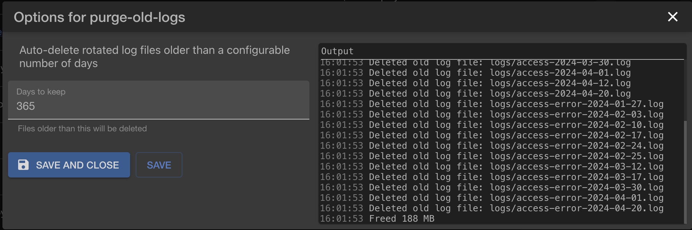

# purge-old-logs

HFS plugin to automatically delete rotated log files older than a configurable number of days.

As soon as this plugin starts, will delete 365 days old logs. You can then change the number.

HFS ~ HTTP File Server https://github.com/rejetto/hfs
